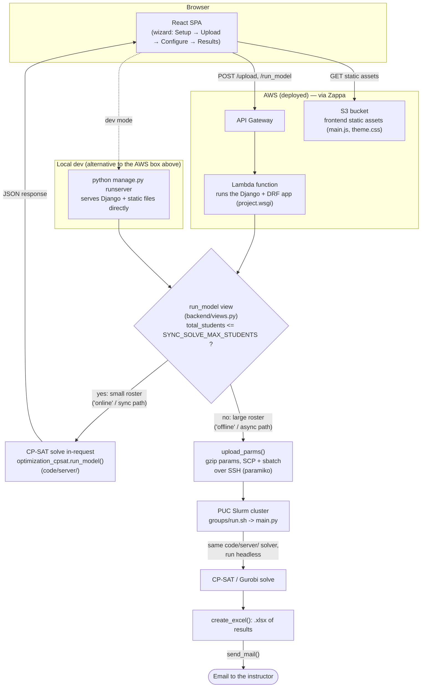

# MATE Architecture

MATE ("Make A Team Efficiently") splits a roster of students into balanced
groups. This document describes how it's built, why the model is shaped the
way it is, and how a request actually flows through the system.

## 1. Overview

Instructors regularly need to split a class into project groups subject to
constraints that fight each other: balance gender/university/major across
groups, make sure a group's students all share a free time slot, and give
students a fair shot at the project topics they actually ranked highly. Doing
this by hand for a few dozen students is tedious; doing it well for a few
hundred is effectively impossible without solving an optimization problem.

MATE turns that problem into a constrained-optimization model: given a
roster (with each student's attributes, section availability, and ranked
topic preferences) and a set of instructor-configured bounds, find a group
assignment that satisfies every hard constraint (group size, section
capacity, attribute balance, topic coverage) while minimizing how far
students land from their top preferences. An instructor uses a four-step
wizard (Setup → Upload → Configure & run → Results) to define the problem
and gets back either a solved roster in-browser or, for large problems, an
emailed spreadsheet once a compute cluster finishes the solve.

## 2. Stack

| Layer | Technology | Where |
|---|---|---|
| Backend | Django + Django REST Framework | `code/client/` |
| Frontend | React 16, hand-rolled Webpack 4 (no Create React App) | `code/client/frontend/` |
| Optimization core | Google OR-Tools CP-SAT (default), Gurobi (optional swap-in) | `code/server/` |
| Hosting | AWS Lambda + API Gateway + S3 (static), via Zappa | `code/client/zappa_settings.json` |
| Large-job compute | PUC university Slurm cluster, driven over SSH/SCP (paramiko) | `code/server/run.sh`, `code/client/backend/utils.py` |

`code/client/` is the Django project — it serves the API, renders the
frontend's template shell, and (for small rosters) runs the solver
in-request. `code/server/` is solver-agnostic optimization code that predates
the Django app and still runs standalone on the Slurm cluster via
`code/server/main.py`; the Django app imports it directly (`project/settings.py`
inserts `code/server` into `sys.path` — see §8) rather than duplicating it.
`code/client/frontend/` is the React single-page app that implements the
wizard; it's built with a plain Webpack config (`webpack.config.js`, no CRA
tooling) into `code/client/frontend/static/main.js`, which Django serves.

Solver choice is a one-line environment switch. `code/client/backend/views.py`'s
`_run_solver()` lazily imports either `optimization.py` (Gurobi, when
`MATE_SOLVER=gurobi`) or `optimization_cpsat.py` (OR-Tools CP-SAT, the
default) — lazily, so a missing/unlicensed `gurobipy` only breaks a request
that actually asked for Gurobi, never the default CP-SAT path or the rest of
the Django process.

Locally the app runs via `python manage.py runserver` (Django's dev server,
serving static files directly when `DJANGO_DEBUG` is truthy — see
`project/settings.py`). In production, Zappa packages the whole Django app
(the same WSGI app, unmodified) to run inside an AWS Lambda function fronted
by API Gateway; the built frontend assets are pushed to an S3 bucket instead
of being served from Django's own static-file machinery.

## 3. Architecture diagram



The fork point is `run_model` in `code/client/backend/views.py` (see §8):
small rosters are solved synchronously inside the Django process/Lambda
invocation and the browser gets JSON back directly; large rosters are hand-
ed off to the Slurm cluster and the browser only ever hears "queued" — the
result arrives later, by email, as a spreadsheet.

## 4. The model

The CP-SAT formulation lives in `code/server/optimization_cpsat.py`'s
`_build_model()` (starts at line 157). It's a straight translation of an
original Gurobi MIP formulation from the project's earlier design
documentation (not included in this repo); `optimization.py`
(the Gurobi backend) and `optimization_cpsat.py` share their non-solver
logic through `code/server/model_common.py` so the two backends can't drift
apart on what a "group" or a "topic family" means.

### Sets

| Notation | Meaning | Code |
|---|---|---|
| `I` | student types | `T` (confusingly, code calls this `T`, not `I` — see the callout below) |
| `NA ⊆ I` | types with unknown/unanswered preferences | `not_answered` |
| `R` | attribute *values* (e.g. `"Gender:Male"`) | `A` (`params["A"]`), attribute key strings `f"{attr}:{value}"` |
| `G` | candidate groups (topic × section slot) | `G` — built by `model_common.preprocessing()` |
| `T` | topics | `preferences` (the list of ranked topic names) |
| `M` | sections/time-slots | `D` / `modules` |
| `G_t`, `G_m`, `G_tm` | groups by topic / by section / by topic-and-section | `G_t`, `G_d`, `G_td` — built directly by `model_common.preprocessing()` |

**Naming collision to flag explicitly**: the original formulation's `I`
(student types) is called `T` in the code, and its `T` (topics) is called
`preferences` in the code. This documentation uses the original formulation's
letter notation (`I` for types, `T` for topics) when discussing the math
below, but quotes the actual code identifiers (`T`, `preferences`) whenever
citing code.

### Key decision variable: `y[i, g]`

```python
y = {(i, g): model.NewIntVar(0, upper_number, f"y_{i}_{g}") for i in T for g in G}
```

`y[i, g]` is an **integer** — how many students of type `i` are assigned to
group `g` — not a binary "is student *s* in group *g*" variable per student.
This is the whole point of the student-type preprocessing step (§5): the
model only ever reasons about *counts* of interchangeable students, never
about individual student identities, and the actual per-student rosters are
reconstructed afterwards (§7).

### Other variables

| Code | Manual | Meaning |
|---|---|---|
| `w[g]` | `w_g` | 1 if group `g` has any student assigned, else 0 |
| `z[i]` | `z_i` | total priority-cost accumulated by type `i`'s assignment |
| `z_max` | `z_max` | the worst (highest) `z[i]` across all types — the worst-off student type |
| `Q[g, attr_key]` | `q_{gr}` | how many students with attribute-value `attr_key` end up in group `g` |
| `P[g, attr_key]` | `p_{gr}` | 1 if group `g` has *zero* students with that attribute-value (only meaningful when that attribute-value is configured "solo": no group may have none of this trait) |
| `M[g]` | `m_g` | how many students of unknown preference end up in group `g` |
| `M_max` | `m_max` | the worst (highest) `M[g]` across all groups |
| `u[p, d]` | `u_{tm}` | 1 if topic `p` is assigned into section `d` |
| `o[p]` | `o_t` | 1 if any group is actually formed for topic `p` |

### Objective

```python
model.Minimize(
    sum(students_types[i]["flexibility"] * z[i] for i in T) + BALANCE_CONSTANT * (z_max + M_max)
)
```

matches the manual's

> min  Σᵢ Nᵢzᵢ + 1000·z_max + 1000·m_max

exactly, with `BALANCE_CONSTANT = 1000` playing the role of the manual's
hardcoded `1000` weight (`K` in the code's comment), and `flexibility`
playing the role of `N_i` — the manual defines `N_i` as a type's total
section availability (`Σ_m D_im`); the code computes the same value as
`StudentType.flexibility = sum(int(d) for d in disponibilities)`
(`code/client/backend/utils.py`). The first term minimizes total
assigned-priority (cheap topic-preference mismatches, weighted by how
flexible a type's schedule is), and the `1000×` terms heavily penalize
whichever single student type is worst off (`z_max`) and whichever single
group ends up with the most "we don't know this student's real preference"
placements (`M_max`) — so the solver won't trade one badly-served type for a
slightly cheaper average across everyone else.

### Cross-check against the original formulation

The original Gurobi formulation's constraints (a) through (q) all have a direct counterpart
in `_build_model()`: (a) `sum(y[i,g] for g in G) == students_types[i]["students"]`,
(b) `y[i,g] <= upper_number * w[g]`, (c) `sum(w[g]) == groups_number`,
(d) the `lower_number`/`upper_number` group-size band, (e) the per-topic
coverage bounds via `G_t`, (h)/(i) the `M[g]`/`M_max` unknown-preference
bookkeeping, (j)/(k) `z[i]`/`z_max`, (l)/(m) the attribute-balance `Q`/`P`
pair, (n) section capacity and per-type availability, (o)/(p) the
same-section (`sameDay`) and fixed-section (`fixedDay`) rules via `u[p, d]`.
The implementation matches the formulation with a couple of UI-facing
renames rather than any behavioral difference — most visibly,
`group_display_name()` in `code/server/model_common.py` (line 52) strips an
internal `"Tema "` ("topic" in Spanish) prefix and a disambiguating `"(Nn)"`
suffix from a group's internal identifier (e.g. `"Tema Scheduling - Mon
10:00 (N1)"`) before it's shown to the user (`"Scheduling - Mon 10:00"`) —
the internal, undisplayed identifier is still what's used to index
constraints.

## 5. Preprocessing: student types instead of one variable per student

A naive model would have one decision variable per `(student, group)` pair.
With hundreds of students and dozens of groups that's a large, heavily
*symmetric* search space: any two students with identical attributes, topic
preferences, and section availability are functionally interchangeable, so a
solver reasoning about individual students would waste time exploring
assignments that differ only in *which* interchangeable student went where
— those are the same solution, relabeled, and CP-SAT has to rediscover that
equivalence on its own unless the model is built to avoid creating it.

`create_students_types()` in `code/client/backend/utils.py` (starts at line
163) avoids this by grouping students into **student types** before the
model is ever built: two students are the same type if and only if they
have the same attributes, the same topic preferences, and (when sections are
configured) the same section availability. The type key is built as

```python
student_type_id = f"{attributes} - {preferences} - {disponibilities}"
```

(line 172; the server-side solver mirrors the identical logic in
`code/server/utils.py`'s `student_to_student_type_id()`, so a type computed
during upload and a type looked up mid-solve always agree). Each type
(`StudentType`, same file, line ~46) carries a `students` count (the
manual's `R_i`) and a `students_list` of the actual original student IDs
that belong to it.

**Concrete example**: 50 students who are all Male, from PUC, ranked
Scheduling 1st and Vehicle Routing 2nd, with no other differences, collapse
into a single student type with `students = 50` — the model gets **one**
`y[i, g]` variable per group for that type, not fifty. If those same 50
students had been modeled individually, the solver would face
50!-many equivalent relabelings of any given assignment among themselves
alone; collapsing them removes that symmetry entirely rather than asking
the solver to discover and discard it during search.

In practice a roster of a few hundred students typically collapses down to
a much smaller number of distinct types — often driven by how many attribute
combinations and topic-preference orderings actually occur — which shrinks
both the variable count (`|T| × |G|` instead of `|students| × |G|`) and the
symmetry the solver has to contend with.

## 6. The greedy warm-start heuristic

`_greedy_hint()` in `code/server/optimization_cpsat.py` (starts at line 423)
is a cheap, pure-Python constructive heuristic — it makes no solver calls —
that builds a plausible-but-not-necessarily-optimal initial assignment,
handed to CP-SAT via `model.AddHint()` in `run_model()` (line ~502) so the
solver's search starts from a reasonable point instead of nothing.

It runs in two passes:

1. **Preference pass** — for each student type, in rank order of that
   type's ranked topics (1st choice first, then 2nd, ...), first-fit as many
   of that type's students as will fit into a group belonging to that topic
   (and, if sections are configured, restricted to a section the type
   actually marked available).
2. **Fallback pass** — whatever's left over (types that couldn't be fully
   placed into any of their ranked topics — because that topic's groups
   filled up before this type's turn, or the type isn't available for any
   section its ranked topic runs in) gets dumped into *any* group the type
   can physically sit in, ignoring preference entirely, purely so the hint
   is a *complete* assignment.

It only respects **structural** constraints — section availability and
per-group capacity (`upper_number`) — and ignores the objective and every
balance/soft bound entirely. That's fine: CP-SAT treats a hint as a
suggestion for where to start searching, not as a solution that has to be
feasible or good, so a rough-but-cheap answer is enough to be useful.

`_greedy_hint()` takes `G`, `T`, `G_t`, `G_d`, `G_td` as parameters rather
than recomputing them — these are the same structures `_build_model()`
already computed once (returned as part of its `ctx`). This wasn't always
true: earlier, `_greedy_hint()` independently re-ran `preprocessing()` a
second time on every solve, silently duplicating work `_build_model()` had
already done. That redundant call was found and fixed this session, commit
`85af88a`.

**Benchmark results** (from the function's own docstring and the commit
history, `381cb87` / `85af88a`): the hint is applied unconditionally — it
never hurt in testing, only helped or was a no-op — with a real, repeatable
win at scale. On a synthetic 400-student / 60-group roster, mean solve time
dropped from ~29.4s (range 24.9–34.4s across repeated runs) to ~22.7s (range
22.5–22.9s), both reaching `OPTIMAL`; the hinted runs were also noticeably
more consistent run-to-run, not just faster on average. At 150 students it
was roughly a wash (~3.2s either way). A separate, unrelated speedup
candidate — lexicographic symmetry-breaking constraints — was benchmarked
alongside it and *rejected*: it measurably slowed every solve down (+45% at
150 students, +300%+ at 400, the larger case not even finishing an
optimality proof within the time cap), likely because CP-SAT's own internal
symmetry detection already handles this and the extra inequality chains
interfere with its search more than they prune it. That code path is kept
in `optimization_cpsat.py` behind `_ENABLE_SYMMETRY_BREAKING = False` as a
documented dead end rather than deleted.

## 7. Post-processing: turning type-counts back into actual students

The solved model only tells you `y[i, g]` — how many students of type `i`
ended up in group `g`, a **count**, not *which* students. `assign_students()`
in `code/server/optimization_cpsat.py` (starts at line 105) does the
reverse mapping:

```python
def assign_students(students_dict, students_types, student_type_name, solver, y, T):
    students = []
    for i in T:
        sol = solver.Value(y[i, student_type_name])
        if sol > 0:
            student_type = students_types[i]
            for _ in range(sol):
                student = student_type["students_list"].pop()
                students.append(students_dict[student])
    return students
```

For each type `i` and group `g` where the solved `y[i, g] > 0`, it pops that
many actual student IDs off type `i`'s `students_list` (the list of original
student IDs built during preprocessing, §5) and looks each one up in the
original student dictionary — building the real per-group roster that the
Results screen and the emailed Excel export both show.

This is what makes the type-collapsing trick from §5 transparent to the end
result: the solver only ever reasoned about counts of interchangeable
types, but the UI still gets back real, individually-identified students per
group. Which specific student from a type lands in which of that type's
assigned groups is an arbitrary but valid choice — `.pop()` order is fine
precisely because every member of a type is, by construction, interchangeable
(same attributes, same preferences, same availability), and the model's
optimality is already proven at the type level, so no student-level choice
within a type can make the assignment better or worse.

## 8. Online vs. offline flow for large models

`run_model` in `code/client/backend/views.py` (starts around line 91)
branches on roster size:

```python
if total_students <= settings.SYNC_SOLVE_MAX_STUDENTS:
    ...
```

**Small rosters (`total_students <= SYNC_SOLVE_MAX_STUDENTS`, default 60 —
`project/settings.py`)** take the *online*/sync path: `_run_solver()` calls
straight into `optimization_cpsat.run_model()` (or `optimization.run_model()`
for Gurobi) inside the same Django worker/Lambda invocation that received
the HTTP request, and the JSON response — groups, per-group rosters, the
preference-outcome tally — goes straight back to the browser. This is the
path the live demo (§9) exercises; a 48-student roster resolves in well
under a second.

**Large rosters** take the *offline*/async path instead. `upload_parms()`
in `code/client/backend/utils.py` (starts at line 63):

1. gzip-compresses the full solve parameters (`compressStringToBytes()`),
2. opens an SSH connection (`paramiko`) to the PUC cluster
   (`cluster.ing.uc.cl`, credentials from `code/client/.env` — see the
   `MATE_CLUSTER_*` environment variables),
3. SCPs the compressed params to `{PARAMS_PATH}/{ID}_params.txt`, and
4. submits `sbatch groups/run.sh {ID}` over the same SSH session.

The Slurm job (`code/server/run.sh`) runs `code/server/main.py`, which reads
the params back (`get_data()`), calls the *same* `run_model()` from
`code/server/` (headless — no Django, no HTTP), and, per
`code/server/utils.py`'s `create_excel()` / `send_mail()` /
`send_admin_mail()`, builds an `.xlsx` of the results and emails it to the
instructor (plus a copy to the app's admin address). There is no polling
from the browser — `run_model` returns `{"queued": True}` immediately and
the user finds out the job is done when the email arrives.

**Why this split exists**: CP-SAT solve time grows with problem size (more
student types, more groups, more constraints), and a synchronous HTTP
request — and, when deployed, the AWS Lambda function it runs inside — can't
sit open indefinitely; API Gateway hard-caps a request at 29 seconds, well
under what a large roster's solve can take. Anything past the configured
size threshold is routed to compute with no such wall-clock limit, at the
cost of turning the request into a fire-and-forget submission instead of a
request/response round trip.

## 9. Demo

A local `mate_demo_roster.xlsx` (48 fake students) was uploaded through the
live wizard against a running `python manage.py runserver` instance,
configured exactly as follows:

- **Attributes**: `Gender`, `Home university`
- **Sections**: `Mon 10:00`, `Wed 15:00`
- **Topics**: `Scheduling`, `Vehicle routing`, `Supply chain`, `Data pipelines`
- **Preference rank count**: `2`
- **Configure & run**: target groups `8`, group-size band `5–7`

### Step 1 — Define parameters


Attributes, sections, and topics chip-entered exactly as above; preference
rank count set to 2.

### Step 2 — Upload roster


`mate_demo_roster.xlsx` uploaded successfully — 48 students parsed, with a
live breakdown by gender (31 F / 17 M), home university (29 PUC / 19 Other),
section availability, and topic-preference distribution.

### Step 3 — Configure & run


Group size band set to 5–7 students, target group count 8. The live summary
panel confirms "Bounds are feasible" before the solve is even triggered.

### Step 4 — Results


Solved `OPTIMAL` in 0.9s: 8 groups formed, all 48 students placed. The
preference-outcome bars show 19 students (40%) got their 1st choice, 9 (19%)
their 2nd, and 20 (42%) landed on a topic outside their ranked preferences —
a direct, visible consequence of only 4 topics being configured against 8
groups, so more than half the groups necessarily cover a topic beyond a
student's top two picks. Each group card lists its topic, section, student
count, and member IDs; a "Download results (.xlsx)" button produces the same
spreadsheet the async/offline path emails for large rosters (§8).

These are real screenshots taken against the running app (not mockups) —
this is the small-roster, synchronous (`total_students <= SYNC_SOLVE_MAX_STUDENTS`)
solve path described in §8.
