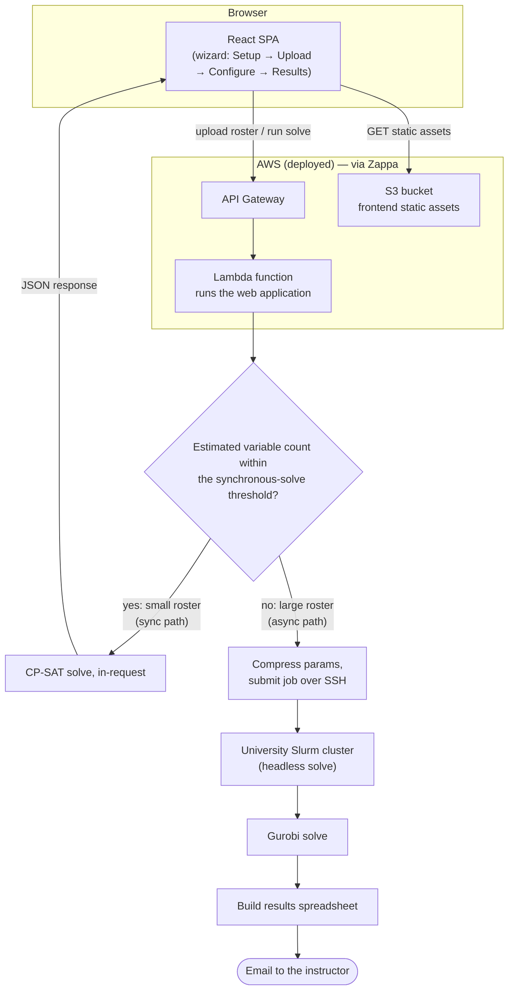

# MATE Architecture

MATE ("Make A Team Efficiently") splits a roster of students into balanced
groups. This document describes how it's built, why the model is shaped the
way it is, and how a request actually flows through the system.

## Contents

1. [Overview](#1-overview)
2. [Stack](#2-stack)
3. [Architecture diagram](#3-architecture-diagram)
4. [The model](#4-the-model)
5. [The greedy warm-start heuristic](#5-the-greedy-warm-start-heuristic)
6. [Sensitivity analysis: what is each requirement costing you](#6-sensitivity-analysis-what-is-each-requirement-costing-you)
7. [Demo](#7-demo)

## 1. Overview

Instructors regularly need to split a class into project groups subject to
constraints that fight each other: balance gender/university/major across
groups, make sure a group's students all share a free time slot, and give
students a fair shot at the project topics they actually ranked highly. Doing
this by hand for a few dozen students is tedious; doing it well for a few
hundred is effectively impossible without solving an optimization problem.

MATE turns that problem into a constrained-optimization model: given a
roster (with each student's attributes, section availability, and ranked
topic preferences) and a set of instructor-configured bounds, find a group
assignment that satisfies every hard constraint (group size, section
capacity, attribute balance, topic coverage) while minimizing how far
students land from their top preferences. An instructor uses a four-step
wizard (Setup → Upload → Configure & run → Results) to define the problem
and gets back either a solved roster in-browser or, for large problems, an
emailed spreadsheet once a compute cluster finishes the solve.

## 2. Stack

| Layer | Technology |
|---|---|
| Backend | Django + Django REST Framework |
| Frontend | React 16, hand-rolled Webpack 4 (no Create React App) |
| Optimization core (default) | Google OR-Tools CP-SAT |
| Optimization core (optional swap-in) | Gurobi, plus preprocessing shared with CP-SAT |
| Hosting | AWS Lambda + API Gateway + S3 (static), via Zappa |
| Large-job compute | PUC university Slurm cluster, driven over SSH/SCP (paramiko) |

## 3. Architecture diagram

The fork point is a size check right after upload — but "size" here means
the model's estimated decision-variable count
(`model_common.estimate_variable_count()`, §4's Preprocessing subsection),
not raw student count: the same headcount can produce very different
variable counts depending on how many distinct student types, topics, and
sections are configured, and variable count is what actually drives solve
time (see the note at the end of this section). Small models are solved
synchronously inside the same request/response cycle and the browser gets
results back directly; large ones are handed off to the cluster and the
browser only ever hears "queued" — the result arrives later, by email, as
a spreadsheet. Either way, the request is first checked against a short
list of pre-flight feasibility rules (§4's "Pre-flight feasibility
checks") before either path is attempted — a request that's mathematically
guaranteed to fail is rejected immediately, with an explanation, instead
of spending a synchronous solve or a cluster job on it.

**Where the synchronous-solve threshold comes from.** A 14-point benchmark
correlated CP-SAT's own reported variable count against real wall-clock
solve time, using production solver settings (the greedy hint applied,
the same relative optimality gap, 8 search workers) and generous time caps
so genuine scaling was measured rather than an artificial cutoff. Solves
stayed comfortably fast (well under a second to a few seconds) up to
around 3,000–4,000 variables; past roughly 5,000–6,000, solve time became
both much larger and much less predictable — two points with similar
variable counts could differ by an order of magnitude in wall time, and
several larger points never reached a proven-optimal solution inside a
60–120s cap at all. 4,000 was chosen as the cutoff: comfortably below
where solve time starts climbing sharply, with enough margin under the
default 30–60s sync budget to absorb that variance.

## 4. The model

MATE poses group assignment as a mixed-integer program: for every candidate
group, decide how many students of each type it receives, subject to
group-size, section-capacity, attribute-balance, and topic-coverage
constraints, while minimizing how far students land from their top-ranked
topics. It reasons over student types rather than individual students — a
type is a set of students who are functionally interchangeable, and
collapsing them into one unit is what keeps the model tractable at real
roster sizes (the Preprocessing subsection just below explains why and
how). Both solver backends, CP-SAT (default) and Gurobi (optional
swap-in), implement the identical formulation below.

### Preprocessing: student types instead of one variable per student

A naive formulation would give every (student, group) pair its own binary
variable $x_{s,g}$ — 1 if student $s$ lands in group $g$, 0 otherwise. With
hundreds of students and dozens of groups that's a large, heavily
*symmetric* search space: any two students with identical attributes, topic
preferences, and section availability are functionally interchangeable, so
a solver reasoning about individual students wastes time exploring
assignments that differ only in *which* interchangeable student went where
— those are the same solution, relabeled, and the solver has to
rediscover that equivalence on its own unless the model is built to avoid
creating it.

MATE avoids this by grouping students into **student types** before the
model is ever built: two students are the same type if and only if they
share the same attributes, the same topic preferences, and (when sections
are configured) the same section availability. Every $x_{s,g}$ collapses
into a single $y_{i,g}$ per type $i$ instead — an **integer** counting how
many students of that type land in group $g$, not a variable per student.
This is the substitution the rest of the model is built around: every set,
variable, and constraint below is written in terms of $y_{i,g}$, never in
terms of individual students.

**Concrete example**: 50 students who are all Male, from PUC, ranked
Scheduling 1st and Vehicle Routing 2nd, with no other differences, collapse
into a single student type with a headcount of 50 — the model gets **one**
$y_{i,g}$ variable per group for that type, not fifty. If those same 50
students had been modeled individually, the solver would face
50!-many equivalent relabelings of any given assignment among themselves
alone; collapsing them removes that symmetry entirely rather than asking
the solver to discover and discard it during search.

In practice a roster of a few hundred students typically collapses down to
a much smaller number of distinct types — often driven by how many
attribute combinations and topic-preference orderings actually occur —
which shrinks both the variable count ($|I| \times |G|$ instead of the far
larger $|\text{students}| \times |G|$) and the symmetry the solver has to
contend with.

Once the model is solved, this collapsing has to be undone: the solution
only reports $y_{i,g}$, a **count**, not *which* students. A
post-processing step reverses the mapping — for each type and group where
the solved count is greater than zero, it pulls that many actual students
off that type's original membership list, producing the real per-group
roster the Results screen and the emailed spreadsheet both show. Which
specific student from a type lands in which of that type's assigned groups
is an arbitrary but valid choice: every member of a type is, by
construction, interchangeable, so no student-level choice within a type
can make the assignment better or worse than the type-level solution
already proven optimal.

### Sets

| Notation | Meaning |
|---|---|
| $I$ | student types |
| $NA \subseteq I$ | types with unknown/unanswered preferences |
| $R$ | attribute *values* (e.g. a specific gender or home university) |
| $G$ | candidate groups (topic × section slot) |
| $T$ | topics |
| $M$ | sections/time-slots |
| $G_t$, $G_m$, $G_{tm}$ | groups by topic / by section / by topic-and-section |

### Key decision variable: $y_{i,g}$

$y_{i,g}$ is an **integer**: how many students of type $i$ are assigned to
group $g$. It's the variable the Preprocessing subsection above
introduces, and every other variable and constraint in this section is
expressed in terms of it.

### Other variables

| Variable | Meaning |
|---|---|
| $w_g$ | 1 if group $g$ has any student assigned, else 0 |
| $z_i$ | total priority-cost accumulated by type $i$'s assignment |
| $z_{max}$ | the worst (highest) $z_i$ across all types — the worst-off student type |
| $q_{g,r}$ | how many students with attribute-value $r$ end up in group $g$ |
| $p_{g,r}$ | 1 if group $g$ has *zero* students with attribute-value $r$ (only meaningful when $r$ is configured "solo": no group may have none of this trait) |
| $m_g$ | how many students of unknown preference end up in group $g$ |
| $m_{max}$ | the worst (highest) $m_g$ across all groups |
| $u_{t,m}$ | 1 if topic $t$ is assigned into section $m$ |
| $o_t$ | 1 if any group is actually formed for topic $t$ |

### Objective

$$\min \sum_i N_i z_i + 1000 \cdot z_{max} + 1000 \cdot m_{max}$$

$N_i$ is a type's total section availability (how many of the configured
sections that type's students can actually attend), computed once during
preprocessing (above). The first term minimizes total assigned-priority
(cheap topic-preference mismatches, weighted by how flexible a type's
schedule is), and the 1000× terms heavily penalize whichever single
student type is worst off ($z_{max}$) and whichever single group ends up
with the most "we don't know this student's real preference" placements
($m_{max}$) — so the solver won't trade one badly-served type for a
slightly cheaper average across everyone else. Both solver backends
implement this identically, with the same 1000 weight on both penalty
terms.

### Variable bounds

Every variable above is declared with the tightest upper bound its role in
the model actually allows, rather than an unbounded one or one scaled to
the whole roster. A group can never hold more than $Q_{max}$ students, so
$y_{i,g}$, $q_{g,r}$, and $m_g$ are all bounded by $Q_{max}$, not by the
size of the whole roster. A type's priority cost $z_i$ can never exceed
1000 times that type's own headcount, so $z_i$ is bounded per type;
$z_{max}$, in turn, only ever needs to be at least as large as the worst
single $z_i$, so its bound is 1000 times the *largest* type's headcount,
not 1000 times the whole roster.

This matters because a solver's search doesn't spend most of its time
reasoning directly about the integer solution a person has in mind — it
spends most of it building and re-solving linear relaxations at each node,
and a looser declared bound means a looser relaxation to start from.
CP-SAT has always declared these bounds explicitly; the Gurobi backend
originally left several of them ($y$, $z$, $z_{max}$, $q$, $m$, and
$m_{max}$) unbounded above and relied entirely on the constraints further
down to pin them in place during solving, instead of declaring them up
front. Both backends now declare the same bounds, computed the same way,
so neither one starts from a weaker relaxation than the other.

### Restrictions

Every constraint below acts on the variables the tables above define. A
few are structural facts about the data — always enforced, never
user-configurable — and the rest are policy choices exposed on the
Configure & run screen. The configurable ones are exactly what the
sensitivity analysis (§6) can relax one at a time to see what each is
costing.

- **Headcount conservation.** Every student type's full headcount is
  placed somewhere: $\sum_g y_{i,g} = R_i$ for every type $i$, where $R_i$
  is that type's headcount.
- **Group activation.** A group can only hold students if it's active:
  $y_{i,g} \le Q_{max} \cdot w_g$.
- **Target group count.** Exactly the requested number of groups is
  formed: $\sum_g w_g = $ the configured group count.
- **Group-size band.** An active group's headcount sits inside the
  configured band: $Q_{min} \cdot w_g \le \sum_i y_{i,g} \le Q_{max} \cdot w_g$.
- **Topic coverage.** Each topic gets between a configured minimum and
  maximum number of active groups (the minimum only applies when every
  configured topic is required to be used — see the next point); a
  separate cap limits how many distinct topics get used at all, so a
  deployment can offer more topics than it commits to actually running.
- **Attribute balance.** For a configured attribute value, an active
  group's headcount of that value sits inside a configured band; for a
  value flagged "solo," a group instead either has *none* of it or at
  least the configured minimum, ruling out a token handful.
- **Section capacity.** Total students sitting in a given time-slot,
  across every one of its groups, can't exceed that slot's configured
  seats.
- **Section availability** (structural). A student type can only be
  placed into a group whose section it marked itself available for.
- **Same-section topics, optional.** A topic can be constrained to run in
  at most one section, so no group of interchangeable students ends up
  split across two time slots for the same topic; specific topic/section
  combinations can also be turned off entirely.
- **Unranked-preference concentration.** A group that ends up with more
  than a small tolerance of "preference not stated" students isn't
  hard-capped — the overflow is tracked and penalized through $m_g$ /
  $m_{max}$ in the objective instead, so it's discouraged rather than
  forbidden.

### Pre-flight feasibility checks

Every restriction above is a real constraint the solver has to satisfy —
but several of them, combined with the request's own numbers, can already
prove a request infeasible *before* a model is ever built.
`model_common.validate_feasibility()` runs a short list of closed-form checks against
every request, sync or async, right after upload: each one is a
sufficient condition for guaranteed infeasibility, traced directly from
the restriction it corresponds to, so a check firing means no assignment
of students to groups can possibly work, regardless of solver, time
budget, or hardware. A request that fails one is rejected immediately,
with a plain-language explanation, instead of spending a synchronous
solve — or a cluster job — on something that was never going to succeed.

- **Section availability.** A student type marked unavailable for every
  configured section gets no $y_{i,g}$ variable at all (the Preprocessing
  subsection's sparse-$y$ construction), so its headcount-conservation
  restriction sums an empty set against a positive headcount — an
  unsatisfiable $0 = R_i$. Found independently twice while benchmarking
  the synchronous-solve threshold above: a single synthetic student with
  no available section silently made an entire roster infeasible.
- **Target group count vs. candidate groups.** Target group count pins
  $\sum_g w_g$ to exactly the requested number of groups — asking for more
  groups than preprocessing can build candidate slots for makes that sum
  unreachable.
- **Group-size band vs. total roster.** Group-size band bounds every
  active group's headcount into $[Q_{min}, Q_{max}]$, and exactly the
  requested number of groups is active — so the whole roster has to fit
  inside $[\text{groups} \cdot Q_{min},\ \text{groups} \cdot Q_{max}]$.
- **Attribute balance vs. total headcount.** For a non-"solo" bound, the
  same per-group band applied across every active group forces the
  roster's *total* headcount with that attribute value into
  $[\text{groups} \cdot min,\ \text{groups} \cdot max]$ too. "Solo" bounds
  are deliberately excluded: they get a free opt-out variable per group
  ($p_{g,r}$ in Other variables, above), so no group is actually forced to
  satisfy the bound, and no closed-form total-headcount check is sound for
  them.
- **Section capacity vs. roster size.** Every student ends up in exactly
  one group, in exactly one section; section capacity is enforced per
  section, so the sum of every section's effective capacity has to be
  able to seat the whole roster.
- **Topic coverage vs. target group count.** Each topic's own candidate
  groups are a disjoint slice of every candidate group, and target group
  count pins their total to exactly the requested number — so summing
  each topic's configured min/max bound over every topic has to bracket
  that same number (the minimum only summed in when every configured
  topic is required to be used, matching the restriction above exactly).

Two more candidate checks were considered and left out, deliberately, as
too subtle to encode confidently as a hard pre-flight failure: a "solo"
attribute bound (noted above), and the interaction between the used-topics
cap and the same-section-topics restriction when sections are configured
(only coupled through $u_{p,d} \le o_p$, and only when both are active
together). Both are left as an easy way to build attribute or topic
configuration that *should* be caught here but isn't — a real solve still
catches them, just later, on the sensitivity/deletion-filter path (§6)
instead of at this pre-flight stage.

An empty result from these checks is not a feasibility guarantee — it
only rules out the mechanisms above. The solve itself is still the only
way to know for sure.

## 5. The greedy warm-start heuristic

Before the solver starts searching, a cheap constructive heuristic builds
a plausible starting assignment and hands it to the solver as a hint, so
the search begins from a reasonable point instead of nothing.

It runs in two passes:

1. **Preference pass** — for each student type, in rank order of that
   type's ranked topics (1st choice first, then 2nd, ...), first-fit as many
   of that type's students as will fit into a group belonging to that topic
   (and, if sections are configured, restricted to a section the type
   actually marked available).
2. **Fallback pass** — whatever's left over (types that couldn't be fully
   placed into any of their ranked topics — because that topic's groups
   filled up before this type's turn, or the type isn't available for any
   section its ranked topic runs in) gets dumped into *any* group the type
   can physically sit in, ignoring preference entirely, purely so the hint
   is a *complete* assignment.

The heuristic only respects **structural** constraints — section
availability and per-group capacity — and ignores the objective and every
balance/soft bound entirely. That's fine: a hint is a suggestion for where
to start searching, not a solution that has to be feasible or good on its
own, so a rough-but-cheap answer is enough to be useful.

Tested against the same model with the hint removed, on synthetic
rosters of 150 and 400 students: roughly a wash at 150 students, but a
consistent win at 400, where mean solving time dropped from about 29s to
about 23s — a reduction of roughly 20% — with both variants still
proving the solution optimal.

## 6. Sensitivity analysis: what is each requirement costing you

Two on-demand analyses are built on the same mechanism: re-solve the
model with one user-configurable constraint family disabled at a time
(the configurable restrictions listed in §4) and see
what changes. One runs when a solve fails, hunting for the minimal set of
bounds that together can't be satisfied. The other runs on a solve that
*succeeded*, asking the complementary question: of the bounds that were
satisfied, which one is the most expensive to keep? For each family, it
reports how many more students would land their #1 ranked topic if that
one bound were relaxed and everything else held fixed — framed as a
percentage-point gain rather than a raw objective delta, since that's the
same unit the Results screen's "Preference outcomes" panel already shows,
and it's comparable across family types (a group-size change and an
attribute-balance change otherwise have no common unit). It's triggered on
demand from a button on the Results screen, deliberately never run
automatically alongside a normal solve — running one extra resolve per
constraint family on every request would reintroduce the same wall-clock
pressure that keeps the synchronous solve path time-limited in the first
place.

**Why the baseline gets its own solve, on identical settings to every
trial.** The production solve is tuned for speed — a short time budget and
a small relative optimality gap, chosen so it comfortably fits the
synchronous request's own time limit — and can return a solution that's
within a fraction of a percent of optimal on the *overall* objective while
still being meaningfully worse on #1-choice placement specifically:
preference priority and the balance penalty share one objective (the same
$1000 \cdot z_{max} + 1000 \cdot m_{max} + \sum_i N_i z_i$ from §4), and
since the unranked-preference penalty is the same order of magnitude as
the balance weight, a small optimality gap on a multi-thousand-point
objective is easily enough slack to flip several students between rank 1
and rank 2 without the solver ever being told to prefer one tied solution
over another. Comparing a baseline solved that way against trials solved
to a tighter tolerance would measure which solve happened to land on a
better tied solution, not which constraint was actually binding — so the
baseline is instead solved to full optimality, on the exact same settings
as every family trial, so any reported gain reflects the family that was
dropped and nothing else. Validated on a small synthetic roster with a
deliberately tight attribute-balance bound: the two balance-bound families
were correctly isolated as the costly ones, with every other family —
group size, topic coverage, section capacity — reporting no meaningful
gain.

## 7. Demo

A local roster of 48 fake students was uploaded through the live wizard
against a running local instance of the application, configured exactly
as follows:

- **Attributes**: `Gender`, `Home university`
- **Sections**: `Mon 10:00`, `Wed 15:00`
- **Topics**: `Scheduling`, `Vehicle routing`, `Supply chain`, `Data pipelines`
- **Preference rank count**: `2`
- **Configure & run**: target groups `8`, group-size band `5–7`

### Step 1 — Define parameters

Attributes, sections, and topics chip-entered exactly as above; preference
rank count set to 2.

### Step 2 — Upload roster

The roster uploaded successfully — 48 students parsed, with a live
breakdown by gender (31 F / 17 M), home university (29 PUC / 19 Other),
section availability, and topic-preference distribution.

### Step 3 — Configure & run

Group size band set to 5–7 students, target group count 8. The live summary
panel confirms "Bounds are feasible" before the solve is even triggered.

### Step 4 — Results

Solved to a proven-optimal assignment in 0.9s: 8 groups formed, all 48
students placed. The
preference-outcome bars show 19 students (40%) got their 1st choice, 9 (19%)
their 2nd, and 20 (42%) landed on a topic outside their ranked preferences —
a direct, visible consequence of only 4 topics being configured against 8
groups, so more than half the groups necessarily cover a topic beyond a
student's top two picks. Each group card lists its topic, section, student
count, and member IDs; a "Download results (.xlsx)" button produces the same
spreadsheet the async/offline path emails for large rosters.

These are real screenshots taken against the running app (not mockups) —
this is the small-roster, synchronous solve path shown in §3's diagram.
