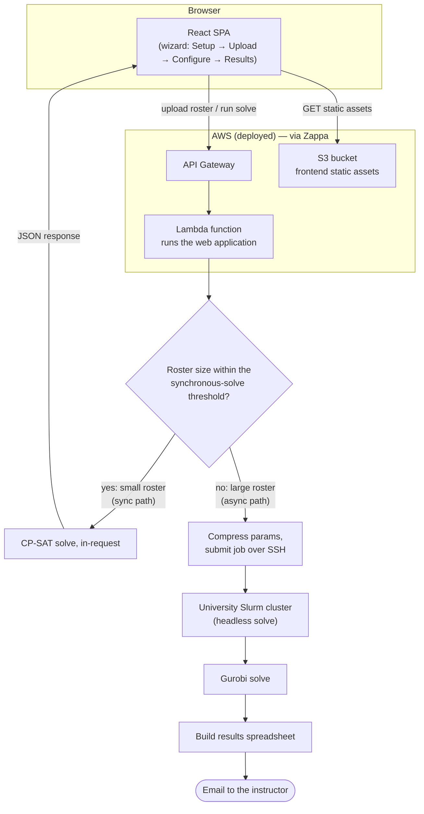

# MATE Architecture

MATE ("Make A Team Efficiently") splits a roster of students into balanced
groups. This document describes how it's built, why the model is shaped the
way it is, and how a request actually flows through the system.

## Contents

1. [Overview](#1-overview)
2. [Stack](#2-stack)
3. [Architecture diagram](#3-architecture-diagram)
4. [The model](#4-the-model)
5. [Preprocessing: student types instead of one variable per student](#5-preprocessing-student-types-instead-of-one-variable-per-student)
6. [The greedy warm-start heuristic](#6-the-greedy-warm-start-heuristic)
7. [Post-processing: turning type-counts back into actual students](#7-post-processing-turning-type-counts-back-into-actual-students)
8. [Sensitivity analysis: what is each requirement costing you](#8-sensitivity-analysis-what-is-each-requirement-costing-you)
9. [User-adjustable sync solve-time budget](#9-user-adjustable-sync-solve-time-budget)
10. [Demo](#10-demo)

## 1. Overview

Instructors regularly need to split a class into project groups subject to
constraints that fight each other: balance gender/university/major across
groups, make sure a group's students all share a free time slot, and give
students a fair shot at the project topics they actually ranked highly. Doing
this by hand for a few dozen students is tedious; doing it well for a few
hundred is effectively impossible without solving an optimization problem.

MATE turns that problem into a constrained-optimization model: given a
roster (with each student's attributes, section availability, and ranked
topic preferences) and a set of instructor-configured bounds, find a group
assignment that satisfies every hard constraint (group size, section
capacity, attribute balance, topic coverage) while minimizing how far
students land from their top preferences. An instructor uses a four-step
wizard (Setup → Upload → Configure & run → Results) to define the problem
and gets back either a solved roster in-browser or, for large problems, an
emailed spreadsheet once a compute cluster finishes the solve.

## 2. Stack

| Layer | Technology |
|---|---|
| Backend | Django + Django REST Framework |
| Frontend | React 16, hand-rolled Webpack 4 (no Create React App) |
| Optimization core (default) | Google OR-Tools CP-SAT |
| Optimization core (optional swap-in) | Gurobi, plus preprocessing shared with CP-SAT |
| Hosting | AWS Lambda + API Gateway + S3 (static), via Zappa |
| Large-job compute | PUC university Slurm cluster, driven over SSH/SCP (paramiko) |

## 3. Architecture diagram

The fork point is the roster-size check right after upload: small
rosters are solved synchronously inside the same request/response cycle
and the browser gets results back directly; large rosters are handed off
to the cluster and the browser only ever hears "queued" — the result
arrives later, by email, as a spreadsheet.

## 4. The model

MATE poses group assignment as a mixed-integer program: for every candidate
group, decide how many students of each type it receives, subject to
group-size, section-capacity, attribute-balance, and topic-coverage
constraints, while minimizing how far students land from their top-ranked
topics. It reasons over student types rather than individual students — a
type is a set of students who are functionally interchangeable, and
collapsing them into one unit is what keeps the model tractable at real
roster sizes (§5 explains why and how). Both solver backends, CP-SAT
(default) and Gurobi (optional swap-in), implement the identical
formulation below.

### Sets

| Notation | Meaning |
|---|---|
| $I$ | student types |
| $NA \subseteq I$ | types with unknown/unanswered preferences |
| $R$ | attribute *values* (e.g. a specific gender or home university) |
| $G$ | candidate groups (topic × section slot) |
| $T$ | topics |
| $M$ | sections/time-slots |
| $G_t$, $G_m$, $G_{tm}$ | groups by topic / by section / by topic-and-section |

### Key decision variable: $y_{i,g}$

$y_{i,g}$ is an **integer** — how many students of type $i$ are assigned to
group $g$ — not a binary "is student $s$ in group $g$" variable per
student. This is the whole point of the student-type preprocessing step
(§5): the model only ever reasons about *counts* of interchangeable
students, never about individual student identities, and the actual
per-student rosters are reconstructed afterwards (§7).

### Other variables

| Variable | Meaning |
|---|---|
| $w_g$ | 1 if group $g$ has any student assigned, else 0 |
| $z_i$ | total priority-cost accumulated by type $i$'s assignment |
| $z_{max}$ | the worst (highest) $z_i$ across all types — the worst-off student type |
| $q_{g,r}$ | how many students with attribute-value $r$ end up in group $g$ |
| $p_{g,r}$ | 1 if group $g$ has *zero* students with attribute-value $r$ (only meaningful when $r$ is configured "solo": no group may have none of this trait) |
| $m_g$ | how many students of unknown preference end up in group $g$ |
| $m_{max}$ | the worst (highest) $m_g$ across all groups |
| $u_{t,m}$ | 1 if topic $t$ is assigned into section $m$ |
| $o_t$ | 1 if any group is actually formed for topic $t$ |

### Objective

$$\min \sum_i N_i z_i + 1000 \cdot z_{max} + 1000 \cdot m_{max}$$

$N_i$ is a type's total section availability (how many of the configured
sections that type's students can actually attend), computed once during
preprocessing (§5). The first term minimizes total assigned-priority
(cheap topic-preference mismatches, weighted by how flexible a type's
schedule is), and the 1000× terms heavily penalize whichever single
student type is worst off ($z_{max}$) and whichever single group ends up
with the most "we don't know this student's real preference" placements
($m_{max}$) — so the solver won't trade one badly-served type for a
slightly cheaper average across everyone else. Both solver backends
implement this identically, with the same 1000 weight on both penalty
terms.

### Variable bounds

Every variable above is declared with the tightest upper bound its role in
the model actually allows, rather than an unbounded one or one scaled to
the whole roster. A group can never hold more than $Q_{max}$ students, so
$y_{i,g}$, $q_{g,r}$, and $m_g$ are all bounded by $Q_{max}$, not by the
size of the whole roster. A type's priority cost $z_i$ can never exceed
1000 times that type's own headcount, so $z_i$ is bounded per type;
$z_{max}$, in turn, only ever needs to be at least as large as the worst
single $z_i$, so its bound is 1000 times the *largest* type's headcount,
not 1000 times the whole roster.

This matters because a solver's search doesn't spend most of its time
reasoning directly about the integer solution a person has in mind — it
spends most of it building and re-solving linear relaxations at each node,
and a looser declared bound means a looser relaxation to start from.
CP-SAT has always declared these bounds explicitly; the Gurobi backend
originally left several of them ($y$, $z$, $z_{max}$, $q$, $m$, and
$m_{max}$) unbounded above and relied entirely on the constraints further
down to pin them in place during solving, instead of declaring them up
front. Both backends now declare the same bounds, computed the same way,
so neither one starts from a weaker relaxation than the other.

## 5. Preprocessing: student types instead of one variable per student

A naive model would have one decision variable per (student, group) pair.
With hundreds of students and dozens of groups that's a large, heavily
*symmetric* search space: any two students with identical attributes, topic
preferences, and section availability are functionally interchangeable, so a
solver reasoning about individual students would waste time exploring
assignments that differ only in *which* interchangeable student went where
— those are the same solution, relabeled, and CP-SAT has to rediscover that
equivalence on its own unless the model is built to avoid creating it.

This is avoided by grouping students into **student types** before the
model is ever built: two students are the same type if and only if they
have the same attributes, the same topic preferences, and (when sections
are configured) the same section availability. The type key is built from
a student's attributes, preferences, and section availability, computed
the same way wherever a type needs to be looked up, so a type computed at
upload time and a type looked up mid-solve always agree. Each type carries
a students count (the manual's $R_i$) and a list of the actual original
student IDs that belong to it.

**Concrete example**: 50 students who are all Male, from PUC, ranked
Scheduling 1st and Vehicle Routing 2nd, with no other differences, collapse
into a single student type with a headcount of 50 — the model gets **one**
$y_{i,g}$ variable per group for that type, not fifty. If those same 50
students had been modeled individually, the solver would face
50!-many equivalent relabelings of any given assignment among themselves
alone; collapsing them removes that symmetry entirely rather than asking
the solver to discover and discard it during search.

In practice a roster of a few hundred students typically collapses down to
a much smaller number of distinct types — often driven by how many attribute
combinations and topic-preference orderings actually occur — which shrinks
both the variable count ($|I| \times |G|$ instead of the far larger
$|\text{students}| \times |G|$) and the symmetry the solver has to contend
with.

## 6. The greedy warm-start heuristic

Before the solver starts searching, a cheap constructive heuristic builds
a plausible starting assignment and hands it to the solver as a hint, so
the search begins from a reasonable point instead of nothing.

It runs in two passes:

1. **Preference pass** — for each student type, in rank order of that
   type's ranked topics (1st choice first, then 2nd, ...), first-fit as many
   of that type's students as will fit into a group belonging to that topic
   (and, if sections are configured, restricted to a section the type
   actually marked available).
2. **Fallback pass** — whatever's left over (types that couldn't be fully
   placed into any of their ranked topics — because that topic's groups
   filled up before this type's turn, or the type isn't available for any
   section its ranked topic runs in) gets dumped into *any* group the type
   can physically sit in, ignoring preference entirely, purely so the hint
   is a *complete* assignment.

The heuristic only respects **structural** constraints — section
availability and per-group capacity — and ignores the objective and every
balance/soft bound entirely. That's fine: a hint is a suggestion for where
to start searching, not a solution that has to be feasible or good on its
own, so a rough-but-cheap answer is enough to be useful.

## 7. Post-processing: turning type-counts back into actual students

The solved model only tells you $y_{i,g}$ — how many students of type $i$
ended up in group $g$, a **count**, not *which* students. A post-processing
step does the reverse mapping: for each type $i$ and group $g$ where the
solved $y_{i,g}$ is greater than zero, it pulls that many actual students
off type $i$'s list of original members (built during preprocessing, §5) —
building the real per-group roster that the Results screen and the emailed
spreadsheet both show.

This is what makes the type-collapsing trick from §5 transparent to the end
result: the solver only ever reasoned about counts of interchangeable
types, but the person running it still gets back real, individually-
identified students per group. Which specific student from a type lands in
which of that type's assigned groups is an arbitrary but valid choice — any
consistent assignment works precisely because every member of a type is, by
construction, interchangeable (same attributes, same preferences, same
availability), and the model's optimality is already proven at the type
level, so no student-level choice within a type can make the assignment
better or worse.

## 8. Sensitivity analysis: what is each requirement costing you

Two on-demand analyses are built on the same mechanism: re-solve the
model with one user-configurable constraint family disabled at a time
(grouped the same way the Configure & run screen groups them) and see
what changes. One runs when a solve fails, hunting for the minimal set of
bounds that together can't be satisfied. The other runs on a solve that
*succeeded*, asking the complementary question: of the bounds that were
satisfied, which one is the most expensive to keep? For each family, it
reports how many more students would land their #1 ranked topic if that
one bound were relaxed and everything else held fixed — framed as a
percentage-point gain rather than a raw objective delta, since that's the
same unit the Results screen's "Preference outcomes" panel already shows,
and it's comparable across family types (a group-size change and an
attribute-balance change otherwise have no common unit). It's triggered on
demand from a button on the Results screen, deliberately never run
automatically alongside a normal solve — running one extra resolve per
constraint family on every request would reintroduce the same wall-clock
pressure that keeps the synchronous solve path time-limited in the first
place.

**Why the baseline gets its own solve, on identical settings to every
trial.** The production solve is tuned for speed — a short time budget and
a small relative optimality gap, chosen so it comfortably fits the
synchronous request's own time limit — and can return a solution that's
within a fraction of a percent of optimal on the *overall* objective while
still being meaningfully worse on #1-choice placement specifically:
preference priority and the balance penalty share one objective (the same
$1000 \cdot z_{max} + 1000 \cdot m_{max} + \sum_i N_i z_i$ from §4), and
since the unranked-preference penalty is the same order of magnitude as
the balance weight, a small optimality gap on a multi-thousand-point
objective is easily enough slack to flip several students between rank 1
and rank 2 without the solver ever being told to prefer one tied solution
over another. Comparing a baseline solved that way against trials solved
to a tighter tolerance would measure which solve happened to land on a
better tied solution, not which constraint was actually binding — so the
baseline is instead solved to full optimality, on the exact same settings
as every family trial, so any reported gain reflects the family that was
dropped and nothing else. Validated on a small synthetic roster with a
deliberately tight attribute-balance bound: the two balance-bound families
were correctly isolated as the costly ones, with every other family —
group size, topic coverage, section capacity — reporting no meaningful
gain.

## 9. User-adjustable sync solve-time budget

The synchronous solve's time budget is user-adjustable rather than a
fixed setting: the person running a solve can trade "solve faster, show
me *a* result sooner" against "spend the full budget hunting for a better
one" — both are reasonable asks depending on how much they trust the
default grouping and how close to launch they are.

The Configure & run screen has a slider for it, shown only on the
synchronous path — the cluster path isn't affected by this at all, and
uses its own, separate time budget. The requested value is always clamped
to a configured floor and ceiling before it ever reaches the solver: the
slider's own range already keeps a normal request in bounds, but the
server doesn't trust that — a stale client, a hand-crafted request, or a
future interface bug can't buy more solve time than the deployment
allows. The ceiling itself sits comfortably under the platform's own
request-timeout limit, with margin left for the time the solver spends
building the model and computing its warm-start hint (§6) before the
timed search even begins — that setup cost has to fit inside the same
budget too.

The slider's own bounds and default come from server-side configuration
rather than a value hardcoded into the interface, for the same reason
other deployment-tunable thresholds in this app work that way: changing
that configuration changes what the interface offers on the next page
load, with nothing to keep in sync by hand and no rebuild required.

Validated end to end on a representative roster: a missing or invalid
requested value falls back to the default, an out-of-range value clamps
to the configured floor or ceiling, an in-range value is honored exactly,
and a real solve with the value set still placed every student, well
under a second.

## 10. Demo

A local roster of 48 fake students was uploaded through the live wizard
against a running local instance of the application, configured exactly
as follows:

- **Attributes**: `Gender`, `Home university`
- **Sections**: `Mon 10:00`, `Wed 15:00`
- **Topics**: `Scheduling`, `Vehicle routing`, `Supply chain`, `Data pipelines`
- **Preference rank count**: `2`
- **Configure & run**: target groups `8`, group-size band `5–7`

### Step 1 — Define parameters

Attributes, sections, and topics chip-entered exactly as above; preference
rank count set to 2.

### Step 2 — Upload roster

The roster uploaded successfully — 48 students parsed, with a live
breakdown by gender (31 F / 17 M), home university (29 PUC / 19 Other),
section availability, and topic-preference distribution.

### Step 3 — Configure & run

Group size band set to 5–7 students, target group count 8. The live summary
panel confirms "Bounds are feasible" before the solve is even triggered.

### Step 4 — Results

Solved to a proven-optimal assignment in 0.9s: 8 groups formed, all 48
students placed. The
preference-outcome bars show 19 students (40%) got their 1st choice, 9 (19%)
their 2nd, and 20 (42%) landed on a topic outside their ranked preferences —
a direct, visible consequence of only 4 topics being configured against 8
groups, so more than half the groups necessarily cover a topic beyond a
student's top two picks. Each group card lists its topic, section, student
count, and member IDs; a "Download results (.xlsx)" button produces the same
spreadsheet the async/offline path emails for large rosters.

These are real screenshots taken against the running app (not mockups) --
this is the small-roster, synchronous solve path shown in §3's diagram.
