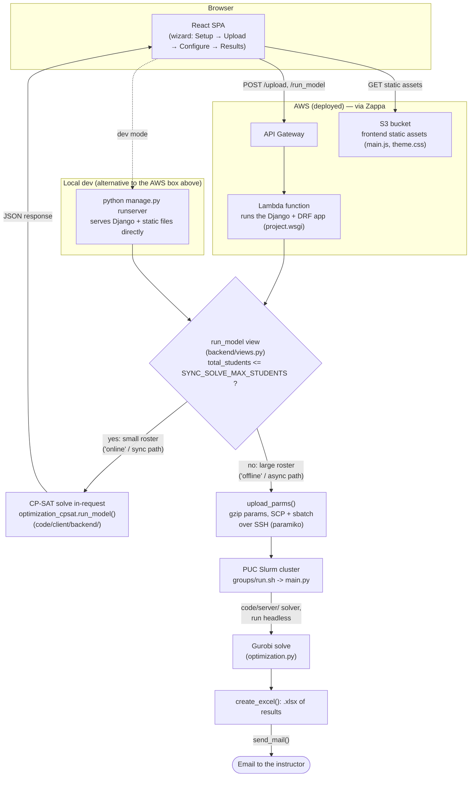
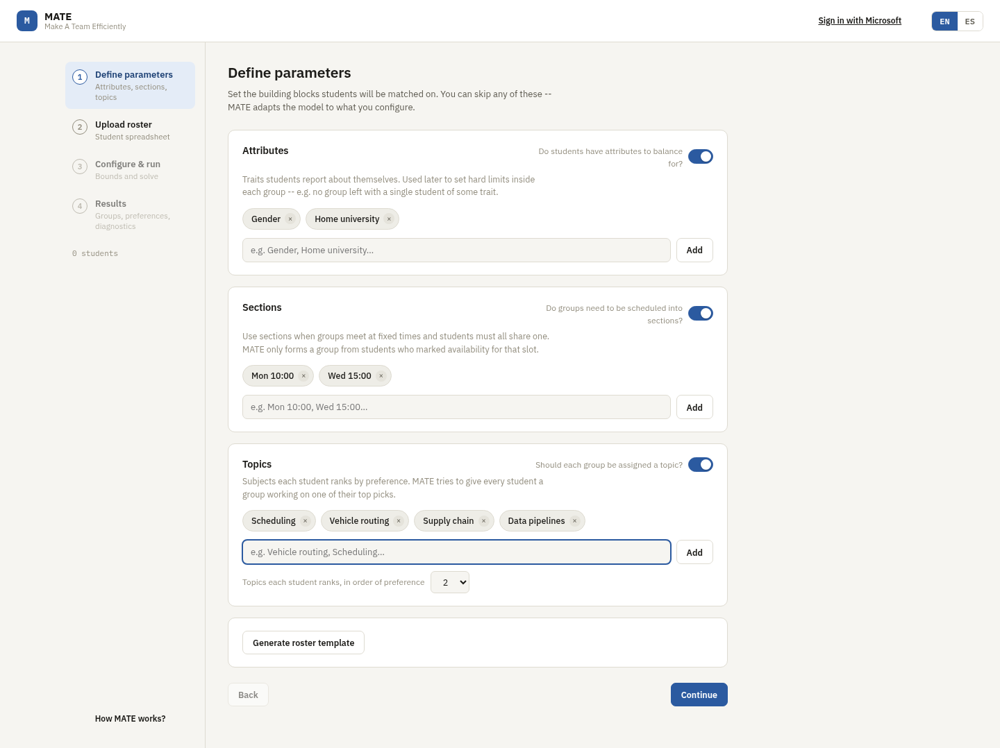
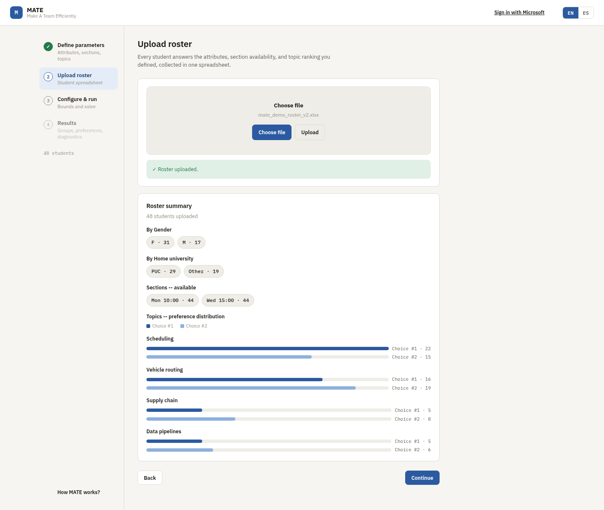
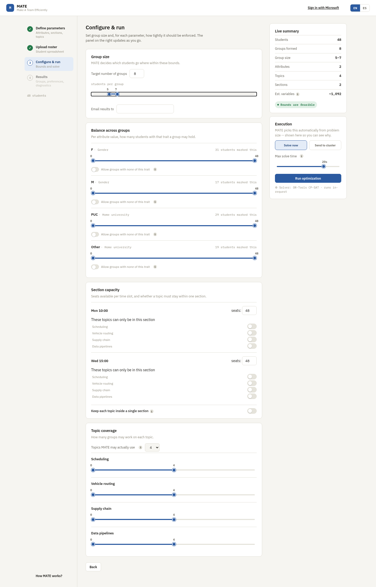
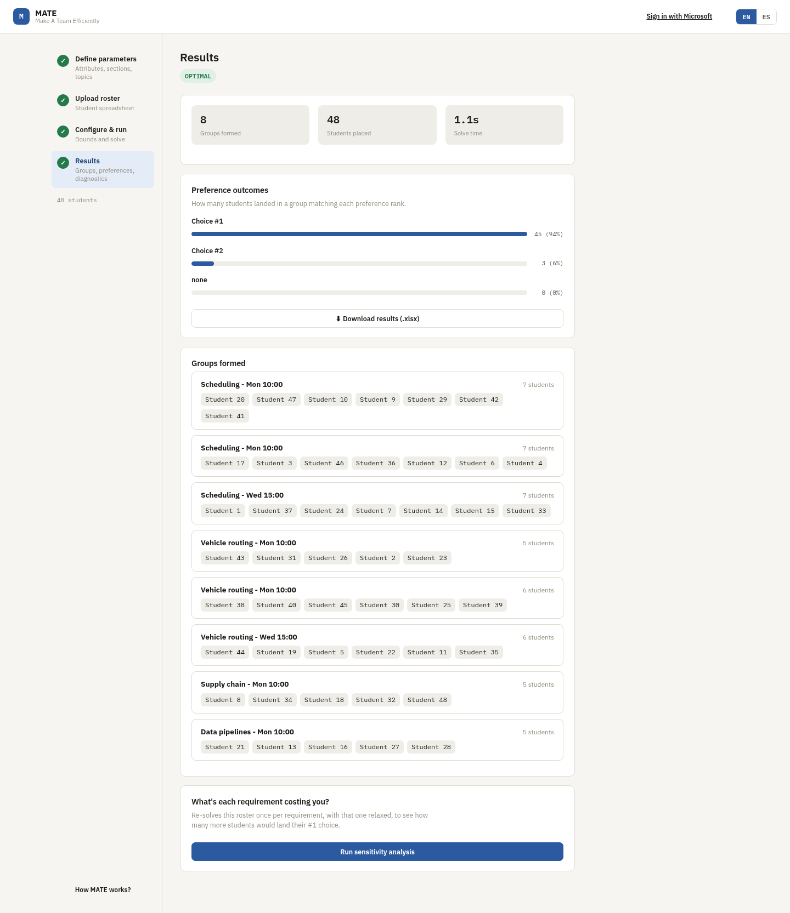

# MATE Architecture

MATE ("Make A Team Efficiently") splits a roster of students into balanced
groups. This document describes how it's built, why the model is shaped the
way it is, and how a request actually flows through the system.

## 1. Overview

Instructors regularly need to split a class into project groups subject to
constraints that fight each other: balance gender/university/major across
groups, make sure a group's students all share a free time slot, and give
students a fair shot at the project topics they actually ranked highly. Doing
this by hand for a few dozen students is tedious; doing it well for a few
hundred is effectively impossible without solving an optimization problem.

MATE turns that problem into a constrained-optimization model: given a
roster (with each student's attributes, section availability, and ranked
topic preferences) and a set of instructor-configured bounds, find a group
assignment that satisfies every hard constraint (group size, section
capacity, attribute balance, topic coverage) while minimizing how far
students land from their top preferences. An instructor uses a four-step
wizard (Setup → Upload → Configure & run → Results) to define the problem
and gets back either a solved roster in-browser or, for large problems, an
emailed spreadsheet once a compute cluster finishes the solve.

## 2. Stack

| Layer | Technology | Where |
|---|---|---|
| Backend | Django + Django REST Framework | `code/client/` |
| Frontend | React 16, hand-rolled Webpack 4 (no Create React App) | `code/client/frontend/` |
| Optimization core (default) | Google OR-Tools CP-SAT | `code/client/backend/optimization_cpsat.py` |
| Optimization core (optional swap-in) | Gurobi, plus preprocessing shared with CP-SAT | `code/server/` |
| Hosting | AWS Lambda + API Gateway + S3 (static), via Zappa | `code/client/zappa_settings.json` |
| Large-job compute | PUC university Slurm cluster, driven over SSH/SCP (paramiko) | `code/server/run.sh`, `code/client/backend/utils.py` |

`code/client/` is the Django project — it serves the API, renders the
frontend's template shell, and (for small rosters) runs the solver
in-request via `code/client/backend/optimization_cpsat.py`, the default,
open-source CP-SAT backend — it lives here rather than in `code/server/`
because this app is the only thing that ever executes it. `code/server/`
predates the Django app and still runs standalone on the Slurm cluster via
`code/server/main.py`, using the Gurobi backend (`optimization.py`); what's
left shared between the two backends is `code/server/model_common.py`'s
solver-agnostic preprocessing, which `project/settings.py` puts on
`sys.path` (see §8) so the Django app can import it directly rather than
duplicating it.
`code/client/frontend/` is the React single-page app that implements the
wizard; it's built with a plain Webpack config (`webpack.config.js`, no CRA
tooling) into `code/client/frontend/static/main.js`, which Django serves.

Solver choice is a one-line environment switch. `code/client/backend/views.py`'s
`_run_solver()` lazily imports either `optimization.py` (Gurobi, when
`MATE_SOLVER=gurobi`) or `optimization_cpsat.py` (OR-Tools CP-SAT, the
default) — lazily, so a missing/unlicensed `gurobipy` only breaks a request
that actually asked for Gurobi, never the default CP-SAT path or the rest of
the Django process.

Locally the app runs via `python manage.py runserver` (Django's dev server,
serving static files directly when `DJANGO_DEBUG` is truthy — see
`project/settings.py`). In production, Zappa packages the whole Django app
(the same WSGI app, unmodified) to run inside an AWS Lambda function fronted
by API Gateway; the built frontend assets are pushed to an S3 bucket instead
of being served from Django's own static-file machinery.

## 3. Architecture diagram

The fork point is `run_model` in `code/client/backend/views.py` (see §8):
small rosters are solved synchronously inside the Django process/Lambda
invocation and the browser gets JSON back directly; large rosters are hand-
ed off to the Slurm cluster and the browser only ever hears "queued" — the
result arrives later, by email, as a spreadsheet.

## 4. The model

The CP-SAT formulation lives in `optimization_cpsat.py`'s `_build_model()`.
It's a straight translation of an original Gurobi MIP formulation from the
project's earlier design documentation (not included in this repo);
`optimization.py` (the Gurobi backend, in `code/server/`) and
`optimization_cpsat.py` share their non-solver logic through
`code/server/model_common.py` so the two backends can't drift apart on what
a "group" or a "topic family" means, or on the bounds each variable below
is declared with.

### Sets

| Notation | Meaning | Code |
|---|---|---|
| `I` | student types | `T` (confusingly, code calls this `T`, not `I` — see the callout below) |
| `NA ⊆ I` | types with unknown/unanswered preferences | `not_answered` |
| `R` | attribute *values* (e.g. `"Gender:Male"`) | `A` (`params["A"]`), attribute key strings `f"{attr}:{value}"` |
| `G` | candidate groups (topic × section slot) | `G` — built by `model_common.preprocessing()` |
| `T` | topics | `preferences` (the list of ranked topic names) |
| `M` | sections/time-slots | `D` / `modules` |
| `G_t`, `G_m`, `G_tm` | groups by topic / by section / by topic-and-section | `G_t`, `G_d`, `G_td` — built directly by `model_common.preprocessing()` |

**Naming collision to flag explicitly**: the original formulation's `I`
(student types) is called `T` in the code, and its `T` (topics) is called
`preferences` in the code. This documentation uses the original formulation's
letter notation (`I` for types, `T` for topics) when discussing the math
below, but quotes the actual code identifiers (`T`, `preferences`) whenever
citing code.

### Key decision variable: y_{i,g}

y_{i,g} is an **integer** — how many students of type i are assigned to
group g — not a binary "is student s in group g" variable per student.
This is the whole point of the student-type preprocessing step (§5): the
model only ever reasons about *counts* of interchangeable students, never
about individual student identities, and the actual per-student rosters are
reconstructed afterwards (§7).

### Other variables

| Variable | Meaning |
|---|---|
| w_g | 1 if group g has any student assigned, else 0 |
| z_i | total priority-cost accumulated by type i's assignment |
| z_max | the worst (highest) z_i across all types — the worst-off student type |
| q_{g,r} | how many students with attribute-value r end up in group g |
| p_{g,r} | 1 if group g has *zero* students with attribute-value r (only meaningful when r is configured "solo": no group may have none of this trait) |
| m_g | how many students of unknown preference end up in group g |
| m_max | the worst (highest) m_g across all groups |
| u_{t,m} | 1 if topic t is assigned into section m |
| o_t | 1 if any group is actually formed for topic t |

### Objective

> min  Σᵢ Nᵢzᵢ + 1000·z_max + 1000·m_max

N_i is a type's total section availability (how many of the configured
sections that type's students can actually attend), computed once during
preprocessing (§5). The first term minimizes total assigned-priority
(cheap topic-preference mismatches, weighted by how flexible a type's
schedule is), and the 1000× terms heavily penalize whichever single
student type is worst off (z_max) and whichever single group ends up with
the most "we don't know this student's real preference" placements
(m_max) — so the solver won't trade one badly-served type for a slightly
cheaper average across everyone else. Both solver backends implement this
identically, with the same 1000 weight on both penalty terms.

### Cross-check against the original formulation

The original Gurobi formulation's constraints (a) through (p) all have a
direct counterpart in the model: (a) every type is fully placed,
Σ_g y_{i,g} = R_i for every i; (b) a group can't receive students unless
it's switched on, y_{i,g} ≤ w_g·Q_max; (c) exactly the target number of
groups gets switched on; (d) the group-size band,
Q_min·w_g ≤ Σ_i y_{i,g} ≤ Q_max·w_g; (e) the per-topic group-count bounds;
(h)/(i) the m_g/m_max unknown-preference bookkeeping; (j)/(k) z_i/z_max;
(l)/(m) the attribute-balance q_{g,r}/p_{g,r} pair; (n) section capacity
and per-type availability; (o)/(p) the same-section and fixed-section
rules via u_{t,m}. The implementation matches the formulation with a
couple of UI-facing renames rather than any behavioral difference — most
visibly, a group's internal identifier carries a disambiguating
prefix/suffix that's stripped before it's shown to the user (e.g.
"Scheduling - Mon 10:00" on screen, for a longer, uglier internal key) —
the internal, undisplayed identifier is still what's used to index
constraints.

### Variable bounds

Every variable above is declared with the tightest upper bound its role in
the model actually allows, rather than an unbounded one or one scaled to
the whole roster. A group can never hold more than Q_max students, so
y_{i,g}, q_{g,r}, and m_g are all bounded by Q_max, not by the size of the
whole roster. A type's priority cost z_i can never exceed 1000 times that
type's own headcount, so z_i is bounded per type; z_max, in turn, only
ever needs to be at least as large as the worst single z_i, so its bound
is 1000 times the *largest* type's headcount, not 1000 times the whole
roster.

This matters because a solver's search doesn't spend most of its time
reasoning directly about the integer solution a person has in mind — it
spends most of it building and re-solving linear relaxations at each node,
and a looser declared bound means a looser relaxation to start from.
CP-SAT has always declared these bounds explicitly; the Gurobi backend
originally left several of them (y, z, z_max, q, m, and m_max) unbounded
above and relied entirely on the constraints further down to pin them in
place during solving, instead of declaring them up front. Both backends
now declare the same bounds, computed the same way, so neither one starts
from a weaker relaxation than the other.

## 5. Preprocessing: student types instead of one variable per student

A naive model would have one decision variable per `(student, group)` pair.
With hundreds of students and dozens of groups that's a large, heavily
*symmetric* search space: any two students with identical attributes, topic
preferences, and section availability are functionally interchangeable, so a
solver reasoning about individual students would waste time exploring
assignments that differ only in *which* interchangeable student went where
— those are the same solution, relabeled, and CP-SAT has to rediscover that
equivalence on its own unless the model is built to avoid creating it.

`create_students_types()` in `code/client/backend/utils.py` avoids this by
grouping students into **student types** before the model is ever built:
two students are the same type if and only if they have the same
attributes, the same topic preferences, and (when sections are configured)
the same section availability. The type key is built by concatenating a
student's attributes, preferences, and section availability into one
string; the server-side solver's own type-key function mirrors this
identical logic, so a type computed during upload and a type looked up
mid-solve always agree. Each type carries a students count (the manual's
R_i) and a list of the actual original student IDs that belong to it.

**Concrete example**: 50 students who are all Male, from PUC, ranked
Scheduling 1st and Vehicle Routing 2nd, with no other differences, collapse
into a single student type with a headcount of 50 — the model gets **one**
y_{i,g} variable per group for that type, not fifty. If those same 50
students had been modeled individually, the solver would face
50!-many equivalent relabelings of any given assignment among themselves
alone; collapsing them removes that symmetry entirely rather than asking
the solver to discover and discard it during search.

In practice a roster of a few hundred students typically collapses down to
a much smaller number of distinct types — often driven by how many attribute
combinations and topic-preference orderings actually occur — which shrinks
both the variable count (`|T| × |G|` instead of `|students| × |G|`) and the
symmetry the solver has to contend with.

## 6. The greedy warm-start heuristic

`_greedy_hint()` in `code/client/backend/optimization_cpsat.py` is a cheap,
pure-Python constructive heuristic — it makes no solver calls — that builds
a plausible-but-not-necessarily-optimal initial assignment, handed to
CP-SAT via `model.AddHint()` in `run_model()` so the solver's search starts
from a reasonable point instead of nothing.

It runs in two passes:

1. **Preference pass** — for each student type, in rank order of that
   type's ranked topics (1st choice first, then 2nd, ...), first-fit as many
   of that type's students as will fit into a group belonging to that topic
   (and, if sections are configured, restricted to a section the type
   actually marked available).
2. **Fallback pass** — whatever's left over (types that couldn't be fully
   placed into any of their ranked topics — because that topic's groups
   filled up before this type's turn, or the type isn't available for any
   section its ranked topic runs in) gets dumped into *any* group the type
   can physically sit in, ignoring preference entirely, purely so the hint
   is a *complete* assignment.

It only respects **structural** constraints — section availability and
per-group capacity (`upper_number`) — and ignores the objective and every
balance/soft bound entirely. That's fine: CP-SAT treats a hint as a
suggestion for where to start searching, not as a solution that has to be
feasible or good, so a rough-but-cheap answer is enough to be useful.

`_greedy_hint()` takes `G`, `T`, `G_t`, `G_d`, `G_td` as parameters rather
than recomputing them — these are the same structures `_build_model()`
already computed once (returned as part of its `ctx`). This wasn't always
true: earlier, `_greedy_hint()` independently re-ran `preprocessing()` a
second time on every solve, silently duplicating work `_build_model()` had
already done. That redundant call was found and fixed this session, commit
`85af88a`.

**Benchmark results** (from the function's own docstring and the commit
history, `381cb87` / `85af88a`): the hint is applied unconditionally — it
never hurt in testing, only helped or was a no-op — with a real, repeatable
win at scale. On a synthetic 400-student / 60-group roster, mean solve time
dropped from ~29.4s (range 24.9–34.4s across repeated runs) to ~22.7s (range
22.5–22.9s), both reaching `OPTIMAL`; the hinted runs were also noticeably
more consistent run-to-run, not just faster on average. At 150 students it
was roughly a wash (~3.2s either way). A separate, unrelated speedup
candidate — lexicographic symmetry-breaking constraints — was benchmarked
alongside it and *rejected*: it measurably slowed every solve down (+45% at
150 students, +300%+ at 400, the larger case not even finishing an
optimality proof within the time cap), likely because CP-SAT's own internal
symmetry detection already handles this and the extra inequality chains
interfere with its search more than they prune it. That code path is kept
in `optimization_cpsat.py` behind `_ENABLE_SYMMETRY_BREAKING = False` as a
documented dead end rather than deleted.

## 7. Post-processing: turning type-counts back into actual students

The solved model only tells you y_{i,g} — how many students of type i
ended up in group g, a **count**, not *which* students. `assign_students()`
in `code/client/backend/optimization_cpsat.py` does the reverse mapping:
for each type i and group g where the solved y_{i,g} is greater than zero,
it pops that many actual student IDs off type i's list of original student
IDs (built during preprocessing, §5) and looks each one up in the original
student dictionary — building the real per-group roster that the Results
screen and the emailed Excel export both show.

This is what makes the type-collapsing trick from §5 transparent to the end
result: the solver only ever reasoned about counts of interchangeable
types, but the UI still gets back real, individually-identified students per
group. Which specific student from a type lands in which of that type's
assigned groups is an arbitrary but valid choice — `.pop()` order is fine
precisely because every member of a type is, by construction, interchangeable
(same attributes, same preferences, same availability), and the model's
optimality is already proven at the type level, so no student-level choice
within a type can make the assignment better or worse.

## 8. Online vs. offline flow for large models

`run_model` in `code/client/backend/views.py` branches on roster size:
small rosters are solved in-request, large ones handed off to compute.

**Small rosters (total_students <= SYNC_SOLVE_MAX_STUDENTS, default 100 —
`project/settings.py`)** take the *online*/sync path: `_run_solver()` calls
straight into `optimization_cpsat.run_model()` (or `optimization.run_model()`
for Gurobi) inside the same Django worker/Lambda invocation that received
the HTTP request, and the JSON response — groups, per-group rosters, the
preference-outcome tally — goes straight back to the browser. This is the
path the live demo (§9) exercises; a 48-student roster resolves in well
under a second.

**Large rosters** take the *offline*/async path instead. `upload_parms()`
in `code/client/backend/utils.py`:

1. gzip-compresses the full solve parameters (`compressStringToBytes()`),
2. opens an SSH connection (`paramiko`) to the PUC cluster
   (`cluster.ing.uc.cl`, credentials from `code/client/.env` — see the
   `MATE_CLUSTER_*` environment variables),
3. SCPs the compressed params to `{PARAMS_PATH}/{ID}_params.txt`, and
4. submits `sbatch groups/run.sh {ID}` over the same SSH session.

The Slurm job (`code/server/run.sh`) runs `code/server/main.py`, which reads
the params back (`get_data()`), calls the *same* `run_model()` from
`code/server/` (headless — no Django, no HTTP), and, per
`code/server/utils.py`'s `create_excel()` / `send_mail()` /
`send_admin_mail()`, builds an `.xlsx` of the results and emails it to the
instructor (plus a copy to the app's admin address). There is no polling
from the browser — `run_model` returns `{"queued": True}` immediately and
the user finds out the job is done when the email arrives.

**Why this split exists**: CP-SAT solve time grows with problem size (more
student types, more groups, more constraints), and a synchronous HTTP
request — and, when deployed, the AWS Lambda function it runs inside — can't
sit open indefinitely; API Gateway hard-caps a request at 29 seconds, well
under what a large roster's solve can take. Anything past the configured
size threshold is routed to compute with no such wall-clock limit, at the
cost of turning the request into a fire-and-forget submission instead of a
request/response round trip.

**Where 100 comes from**: run directly against `optimization_cpsat.run_model()`
(no Django/HTTP in the loop) with the solver's internal time limit set to
match `SYNC_SOLVE_TMAX_SECONDS`, on a roster with several attributes/
sections/topics (richer than the demo roster, to avoid an unrelated
artifact -- see below) -- a 50-student roster solved to OPTIMAL in ~2s, 100
in ~13s, and 150 hit the 20s cap before the solver could prove optimality.
That was measured on hardware with more real CPU than this app's default
Lambda memory allocation grants (Lambda's CPU share scales with configured
memory, and `zappa_settings.json` doesn't set one), so production is
expected to be slower, not faster, than these numbers -- 100 already
has some margin baked in, not zero. Re-benchmark before raising it,
especially after any change to Lambda memory or typical roster complexity.
(The low-cardinality demo roster shape isn't a good benchmark input on its
own: `model_common.get_min_capacity()` caps a section's effective capacity
at how many *distinct student types* are available in it, not how many
students -- a small attribute/topic space collapses a large synthetic
roster into few types and reports spurious infeasibility that's an
artifact of the test data, not a real scaling limit.)

**`params["tmax"]` is a total wall-clock budget, not just a cap on the
CP-SAT search.** Model-building and greedy-hint computation in
`optimization_cpsat.run_model()` run before the timed search starts, and
that setup cost grows with roster size just like the search itself does --
so `run_model()` measures how long build+hint actually took and gives the
solver whatever's left of the configured budget, floored at
`_MIN_SEARCH_SECONDS = 2.0` so a slow build never leaves the solver with
zero time. `backend/tests/sync_solve_benchmark.py` sweeps roster size
through the real `upload`/`run_model` views via `RequestFactory`, using the
frontend's default 4-group shape, and confirms wall time tracks the
configured budget closely (e.g. ~20.0-20.1s at the points that hit the cap)
rather than running past it.

**A known limitation, independent of `SYNC_SOLVE_MAX_STUDENTS`**:
`CreateGroups.js` defaults `groupsNumber` to `Math.min(4, totalStudents)`
regardless of roster size, so the default group shape gets fewer, bigger
groups as a roster grows -- which both solves slower and, at a non-trivial
rate for larger rosters (roughly a third of random trials at N=40-75 in
`sync_solve_benchmark.py`'s sweep), comes back genuinely `INFEASIBLE`
rather than merely slow. A user who sets a group count suited to their
roster size doesn't hit this; one who leaves the default 4 groups on a
large roster may get infeasible or capped-non-optimal results well before
100 students. Worth revisiting `CreateGroups.js`'s default formula
separately -- not addressed here.

**Who can reach the cluster path**: the sync path above is open to anyone
-- free, open-source, runs on this app's own Lambda, nothing to protect.
The cluster path spends a shared, licensed resource (the PUC cluster's
Gurobi seat and compute), so `run_model`'s large-roster branch checks
`msft_auth.session_email_allowed()` before calling `upload_parms()`,
requiring a signed-in `@uc.cl`/`@ing.puc.cl` account (`backend/msft_auth.py`,
`backend/auth_views.py`). Two choices worth calling out:

- **Gating the branch, not the app.** A visitor with no university
  affiliation can still run the small/sync demo end-to-end (exactly what
  this project's own demo script does) -- only a roster big enough to need
  the cluster hits the gate.
- **App-level domain check, not Azure tenant restriction.** The Azure app
  registration accepts sign-in from any organizational (work/school)
  Microsoft account, and this app checks the signed-in email's domain
  itself, rather than registering as single-tenant inside uc.cl's own
  Entra tenant. The latter would be a stronger guarantee but needs
  app-registration rights inside that specific tenant; the former needs
  only an ordinary Microsoft/Azure account to set up, at the cost of
  trusting the ID token's `email`/`preferred_username` claim as the
  boundary (the standard trust boundary for this kind of sign-in). Session
  storage is a signed cookie (`SESSION_ENGINE = signed_cookies` in
  `settings.py`) rather than the Django session default, since this app
  has no database at all (`DATABASES = {}`) for the default engine to use.

## 8b. Sensitivity analysis: what is each requirement costing you

Two on-demand analyses live in `optimization_cpsat.py`, both built on the
same mechanism: re-solve the model with one user-configurable constraint
family disabled at a time (`_candidate_families()` names them the same way
the Configure & run screen does) and see what changes.
`find_infeasibility_causes()` (see its module docstring, above) runs this
when the solve fails, hunting for the minimal set of bounds that together
can't be satisfied. `sensitivity_report()` runs it on a solve that
*succeeded*, asking the complementary question: of the bounds that were
satisfied, which one is the most expensive to keep? For each family, it
reports how many more students would land their #1 ranked topic if that
one bound were relaxed and everything else held fixed -- framed as a
percentage-point gain rather than a raw objective delta, since that's the
same unit the Results screen's "Preference outcomes" panel already shows,
and it's comparable across family types (a group-size change and an
attribute-balance change otherwise have no common unit). Exposed as
`POST /dev/sensitivity/` (`views.sensitivity()`), called on demand from a
button on the Results screen -- deliberately never inline with
`run_model()`, since running O(number of families) extra resolves on every
request would reopen the exact wall-clock-budget problem documented above.

**Why the baseline gets its own solve, on identical settings to every
trial.** `run_model()`'s production tuning (~20s budget, 0.01 relative gap
-- chosen so the sync path stays under API Gateway's 29s cap) can return a
solution that's within 1% of optimal on the *overall* objective while still
being meaningfully worse on #1-choice placement specifically: preference
priority and the balance penalty share one objective (the same
1000·z_max + 1000·m_max + Σᵢ Nᵢzᵢ from §4), and since the unranked-
preference penalty (1000) is the same order of magnitude as the balance
weight (also 1000), a 1% gap on a multi-thousand-point objective is
easily enough slack to flip several students between rank 1 and rank 2
without CP-SAT ever being told to prefer one tied solution over another.
Comparing a baseline solved that way against trials solved to a different,
tighter tolerance would measure which solve happened to land on a better
tied solution, not which constraint was actually binding. `sensitivity_report()`
instead solves the baseline itself on the exact same settings (time limit,
default `relative_gap_limit` of 0, no greedy hint) as every family trial --
see its docstring for the full explanation -- so any reported gain reflects
the family that was dropped. Verified on a small synthetic roster with a
deliberately tight attribute-balance bound (model_common test helpers in
`code/server/tests/conftest.py`): the two balance-bound families are
correctly isolated as costing 2.5 points each, with every other family --
group size, topic coverage, section capacity -- reporting no meaningful
gain.

## 8c. User-adjustable sync solve-time budget

The sync path's CP-SAT budget (§8) is user-adjustable rather than a fixed
admin setting: the person running a solve can trade "solve faster, show me
*a* result sooner" against "spend the full budget hunting for a better
one" -- both are reasonable asks depending on how much they trust the
default grouping and how close to launch they are.

The Configure & run screen has a slider for it (`SingleSlider.js` --
DualSlider's one-thumb sibling, same `.dslider*` CSS) next to the
Sync/Async indicator, visible only on the sync path (the cluster/async path
isn't affected by this at all -- see below). It's sent as a field,
**`maxSolveSeconds`**, deliberately separate from the existing `tmax` field
rather than repurposing it: `tmax` is already overloaded to mean minutes on
the async/cluster path (a Slurm job budget, still hardcoded to 60 in
`CreateGroups.js`) and seconds on the sync path, and giving the sync path
its own unambiguous field avoids adding a second meaning to a number that
already has two.

`views.run_model()` reads `maxSolveSeconds`, falls back to
`SYNC_SOLVE_TMAX_SECONDS` if it's missing or not a valid number, and then
**always clamps** the result to
`[SYNC_SOLVE_TMAX_MIN_SECONDS, SYNC_SOLVE_TMAX_MAX_SECONDS]`
(`project/settings.py`, defaults 5/25) before it ever reaches the solver --
the slider's own min/max already keep a normal request in range, but the
server doesn't trust that: a stale client, a hand-crafted request, or a
future UI bug can't buy more solve time than this deployment allows. 25s
(not the API Gateway's full 29s) is the ceiling for the same margin reason
`SYNC_SOLVE_TMAX_SECONDS`'s own default leaves under that hard cap -- see
§8's "Where 100 comes from" for why build+hint time (not just the timed
search) has to fit inside that same budget too.

The slider's bounds and starting value themselves come from
`window.__MATE_CONFIG__` (`sync_tmax_default_seconds`/`min`/`max`,
extended alongside the existing `sync_max_students` -- `frontend/views.py`'s
`index()`), not a hardcoded copy in `CreateGroups.js`, for the same reason
`syncMaxStudents` is read that way (§8): an admin changing the env vars
(`MATE_SYNC_TMAX_MIN_SECONDS`/`MATE_SYNC_TMAX_MAX_SECONDS`) changes what the
UI offers on the next page load, with nothing to keep in sync by hand and
no frontend rebuild required.

Verified end to end with a `RequestFactory` check mirroring
`backend/tests/e2e_smoke_test.py`'s validated 50-student/8-group roster:
missing/invalid `maxSolveSeconds` falls back to the default, out-of-range
values clamp to the configured floor/ceiling, an in-range value is honored
exactly, and a real (unpatched) solve with the new field set still placed
all 50 students (`OPTIMAL`, well under a second).

## 9. Demo

A local `mate_demo_roster.xlsx` (48 fake students) was uploaded through the
live wizard against a running `python manage.py runserver` instance,
configured exactly as follows:

- **Attributes**: `Gender`, `Home university`
- **Sections**: `Mon 10:00`, `Wed 15:00`
- **Topics**: `Scheduling`, `Vehicle routing`, `Supply chain`, `Data pipelines`
- **Preference rank count**: `2`
- **Configure & run**: target groups `8`, group-size band `5–7`

### Step 1 — Define parameters

Attributes, sections, and topics chip-entered exactly as above; preference
rank count set to 2.

### Step 2 — Upload roster

`mate_demo_roster.xlsx` uploaded successfully — 48 students parsed, with a
live breakdown by gender (31 F / 17 M), home university (29 PUC / 19 Other),
section availability, and topic-preference distribution.

### Step 3 — Configure & run

Group size band set to 5–7 students, target group count 8. The live summary
panel confirms "Bounds are feasible" before the solve is even triggered.

### Step 4 — Results

Solved `OPTIMAL` in 0.9s: 8 groups formed, all 48 students placed. The
preference-outcome bars show 19 students (40%) got their 1st choice, 9 (19%)
their 2nd, and 20 (42%) landed on a topic outside their ranked preferences —
a direct, visible consequence of only 4 topics being configured against 8
groups, so more than half the groups necessarily cover a topic beyond a
student's top two picks. Each group card lists its topic, section, student
count, and member IDs; a "Download results (.xlsx)" button produces the same
spreadsheet the async/offline path emails for large rosters (§8).

These are real screenshots taken against the running app (not mockups) —
this is the small-roster, synchronous (`total_students <= SYNC_SOLVE_MAX_STUDENTS`)
solve path described in §8.
